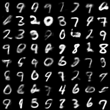

<div align="center">
  <a href="https://zhusuan-pytorch.readthedocs.io/en/latest/?badge=latest"> </a>
</div>

# Zhusuan-PyTorch

[](https://zhusuan-pytorch.readthedocs.io/en/latest/?badge=latest)
[](https://github.com/thu-ml/zhusuan/blob/master/LICENSE)

ZhuSuan-PyTorch is a python probabilistic programming library for
**Bayesian deep learning**, which conjoins the complimentary advantages of
Bayesian methods and deep learning. ZhuSuan-Pytorch is built upon
[PyTorch](https://pytorch.org/). Benefit from the Dynamic graphs feature of PyTorch, ZhuSuan-PyTorch 
could easily build Bayesian Networks by less code.
ZhuSuan-PyTorch provides deep learning style primitives and
algorithms for building probabilistic models and applying Bayesian inference.
The supported inference algorithms include:

* Variational inference with programmable variational posteriors, various
objectives and advanced gradient estimators (SGVB, VIMCO, etc.).

* MCMC samplers: Stochastic Gradient MCMC (sgmcmc), etc.


## example results

| VAE mnist sample                            | VIMCO mnist sample                                |
| ------------------------------------------- | ------------------------------------------------- |
|  |  |


## Installation

ZhuSuan-PyTorch is still under development. Before the first stable release (1.0),
please clone the repository and run

```shell
pip install .
```
in the main directory. This will install ZhuSuan and its dependencies
automatically.  

If you are developing ZhuSuan, you may want to install in an
"editable" or "develop" mode. Please refer to the Contributing section below.

## Documentation

* [Tutorials and API docs](https://zhusuan-pytorch.readthedocs.io/)

## Examples & demo code

### Distribution

We can create a univariate distribution(Normal as example) and sample from it in ZhuSuan by:

```python
import zhusuan as zs
dist = zs.distributions.Normal(mean=[0., 1.], logstd=[0., 0.])
sample = dist.sample()
print(sample.shape)
# torch.Size([2])
samples = dist.sample(10)
print(samples.shape)
# torch.Size([10, 2])
```


## BayesianNet

We can build Bayesian networks as a class by inherit `BayesianNet` class.

```python
from zhusuan.framework.bn import BayesianNet
class Net(BayesianNet):
    def __init__(self):
        # Initialize...
    def forward(self, observed):
        # Forward propagation...
```

using `stochastic_node` method to register a `StochasticTensor`  in the Bayesian network, witch follows a spesefic distribution. we could get the node by name we seted.

```python
import torch
from zhusuan.distributions import Normal
from zhusuan.framework.bn import BayesianNet
model = BayesianNet()
# method listed below are equivalent, w is an sample from passed distribution
# method1
w = model.stochastic_node('Normal', name="w", mean=torch.zeros([5]), std=1.)

# method2
normal = Normal(mean=torch.zeros([5]), std=1.)
w = model.stochastic_node(normal, name="w")

# method3
normal = Normal(mean=torch.zeros([5]), std=1.)
w = model.sn(normal, name="w")

# get the registered node
print(model.nodes["w"])
```

we also need to describe the relationship between nodes, in our framework we define it in `forward` method. A basic `bayesian_linear_regression` show as below:

```python
class bayesian_linear_regression(BayesianNet):
    def __init__(self, alpha, beta):
        super().__init__()
        self.alpha = alpha
        self.beta = beta

    def forward(self, observed):
        self.observe(observed)
        x = self.observed['x']
        w = self.stochastic_node('Normal', name="w", mean=torch.zeros([x.shape[-1]]), std=alpha)
        y_mean = torch.sum(w * x, dim=-1)
        y = self.stochastic_node('Normal', name="y", mean=y_mean, std=beta)
        return self
```

for training or infrence, we just need to instantiate the class and pass observed variables using `dict`.

```python
model = bayesian_linear_regression(alpha, beta)
model({'w': w_obs, 'x': x})
```

see also [detailed introduction](https://zhusuan-pytorch.readthedocs.io/en/latest/tutorials/concepts.html).

We provide examples on traditional hierarchical Bayesian models and recent
deep generative models.

* Bayesian Neural Networks:
  [SGVB](examples/bayesian_neural_nets/bnn_vi.py),
  [SGMCMC](examples/bayesian_neural_nets/bnn_sgmcmc.py)
* Variational Autoencoder (VAE):
  [SGVB](examples/variational_autoencoder/vae_mnist.py), [VIMCO, Importance weighted](https://github.com/thuwzy/ZhuSuan-PyTorch/blob/main/examples/variational_autoencoder/iwae.py)
* normlizing_flows	[NICE](https://github.com/thuwzy/ZhuSuan-PyTorch/blob/main/examples/normlizing_flows/nice_mnist.py), [flow vae](https://github.com/thuwzy/ZhuSuan-PyTorch/blob/main/examples/normlizing_flows/flow_vae.py)


## Contributing

We always welcome contributions to help make ZhuSuan-PyTorch better. If you would like 
to contribute, please check out the guidelines [here](https://zhusuan-pytorch.readthedocs.io/en/latest/contributing.html).


